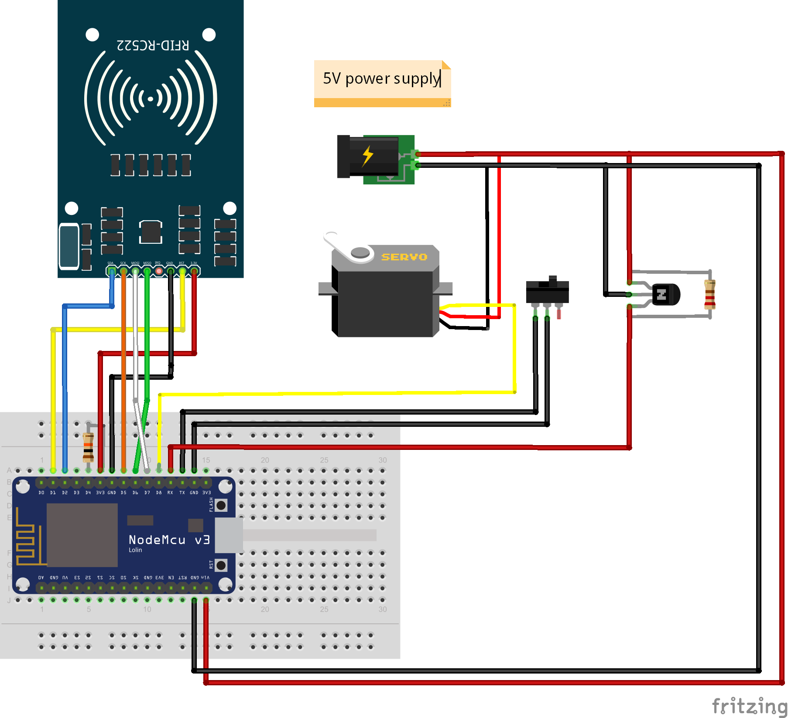
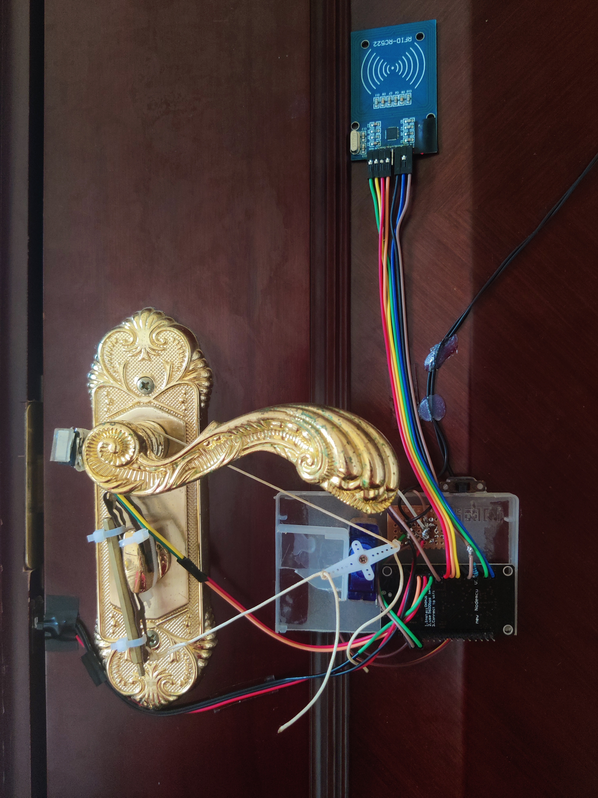

## NFC门锁
1. 使用物理开关、NFC、HomeAssistant控制。
2. 支持检测房门开启和关闭。
3. 房门开启时无法上锁。
4. 定时重启NFC模块防止休眠无法刷卡。
5. 支持WiFi OTA更新固件(第一次刷入需将platformio.ini的上传方式改为串口模式)。
6. 打开"Add/Remove Card"后，首次扫描NFC卡为增加，再次扫描为删除。

## 固件下载
[firmware.bin](https://github.com/QiYueYiya/DoorLock/releases/download/DoorLock/firmware.bin)

## HomeAssistant配置文件
configuration.yaml
```
mqtt:
  sensor:
    - unique_id: door_nfc_uid
      name: "Door NFC UID"
      state_topic: "sensor/door/nfc"
      device:
        name: "门锁"
        model: "DoorLock"
        manufacturer: "厂商名称"
        identifiers: "设备识别符"
  binary_sensor:
    - unique_id: DoorSensor
      name: "房门"
      state_topic: "sensor/door/state"
      device_class: "door"
      device:
        name: "门锁"
        model: "DoorLock"
        manufacturer: "厂商名称"
        identifiers: "设备识别符"
  lock:
    - unique_id: DoorLock
      name: "门锁"
      state_topic: "DoorLock/state"
      command_topic: "DoorLock/cmd"
      payload_lock: "LOCK"
      payload_unlock: "UNLOCK"
      state_locked: "LOCK"
      state_unlocked: "UNLOCK"
      device:
        name: "门锁"
        model: "DoorLock"
        manufacturer: "厂商名称"
        identifiers: "设备识别符"
  switch:
    - unique_id: add_nfc
      name: "Add/Remove Card"
      state_topic: "switch/nfc/state"
      command_topic: "switch/nfc/cmd"
      device:
        name: "门锁"
        model: "DoorLock"
        manufacturer: "厂商名称"
        identifiers: "设备识别符"
```

## 材料
5V电源、导线、霍尔传感器\*1个、微动开关\*1个、小磁铁\*1个、ESP8266nodemcu\*1个、MFRC522模块、SG90舵机\*1个、10K电阻\*2个、发光二极管\*1个。

## 接线
1. 图上的NPN三极管实际为霍尔传感器，连接时请注意霍尔传感器的引脚顺序。
2. 物理开关请使用微动开关或其他无锁开关。
3. 磁铁的磁极方向会影响霍尔传感器感应，请注意磁铁的磁极方向。
4. 发光二极管连接在D4接口上，未在图上标明。



## 实物图


